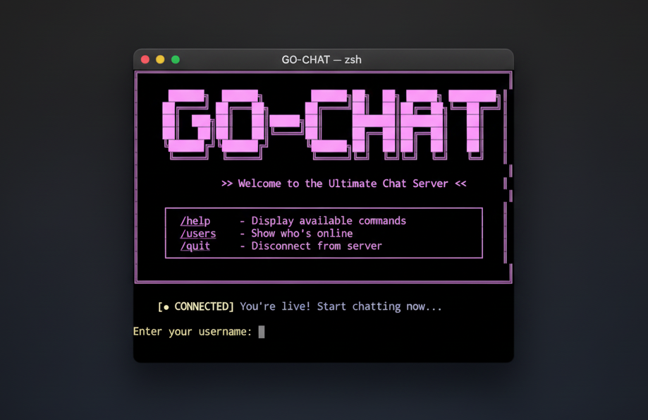

# GO-CHAT

[](https://go.dev/)
[](LICENSE)
[](https://github.com/uthmandev/go-chat/pulls)



A concurrent, feature-rich terminal-based chat server written in Go. GO-CHAT provides a real-time messaging platform with AI integration, multiple chat rooms (lobbies), private messaging, user profiles, and security features including TLS support and rate limiting.

Built as a personal project to explore concurrent programming, network protocols, and AI integration in Go.

## Table of Contents

- [Features](#features)
- [Performance](#performance)
- [Getting Started](#getting-started)
  - [Prerequisites](#prerequisites)
  - [Installation](#installation)
  - [Running the Server](#running-the-server)
- [Connecting to the Server](#connecting-to-the-server)
  - [Using Netcat (nc)](#using-netcat-nc)
  - [Using Telnet](#using-telnet)
  - [Using rlwrap](#using-rlwrap)
  - [Using socat](#using-socat)
- [Configuration](#configuration)
  - [Setting up AI Features](#setting-up-ai-features)
  - [Enabling TLS/SSL](#enabling-tlsssl)
- [Commands Reference](#commands-reference)
- [Features Explained](#features-explained)
  - [Lobbies (Chat Rooms)](#lobbies-chat-rooms)
  - [AI Integration](#ai-integration)
  - [User Profiles](#user-profiles)
  - [Private Messaging](#private-messaging)
  - [Rate Limiting](#rate-limiting)
- [Architecture](#architecture)
  - [Project Structure](#project-structure)
  - [Code Organization](#code-organization)
  - [Server Components](#server-components)
- [Examples](#examples)
- [Troubleshooting](#troubleshooting)
- [Security Considerations](#security-considerations)
- [Roadmap](#roadmap)
- [Development](#development)
- [Acknowledgments](#acknowledgments)
- [Contributing](#contributing)

## Features

- **Real-time messaging** - Instant message delivery using Go's concurrency model
- **Multiple lobbies** - Create public or password-protected chat rooms
- **AI Assistant** - Integrated Gemini AI with context-aware responses
- **Private messaging** - Direct messages and user tagging
- **User profiles** - Customizable profile pictures with 50+ emoji options
- **Rate limiting** - IP-based connection limits and message throttling to prevent abuse
- **TLS/SSL support** - Optional encrypted connections
- **ANSI colors** - Colorful terminal UI with proper formatting
- **Graceful shutdown** - Safe server termination with client notification
- **Message history** - Recent message replay when joining lobbies
- **Context-aware AI** - AI remembers lobby conversation history

## Performance

GO-CHAT is designed to handle typical chat workloads efficiently:

**Capabilities:**
- Concurrent connections: Tested with 100+ simultaneous users
- Message throughput: Suitable for real-time conversation
- Memory usage: ~50MB baseline, ~10KB per connected client
- CPU usage: Minimal under normal chat loads

**System Requirements:**

Minimum:
- 512MB RAM
- 1 CPU core
- Linux/macOS/Windows

Recommended:
- 1GB+ RAM for larger deployments
- 2+ CPU cores
- Linux server
- Good network connectivity

**Note:** This is a learning/hobby project suitable for small to medium deployments (teams, communities, personal use). Not benchmarked for massive scale.

## Getting Started

### Prerequisites

- Go 1.21 or higher
- A Unix-like operating system (Linux, macOS, BSD)
- Terminal emulator with ANSI color support

### Installation

**Option 1: Download Pre-built Binary (Recommended)**

Download the latest release for your platform:

```bash
# Linux/macOS
wget https://github.com/uthmandev/go-chat/releases/latest/download/go-chat
chmod +x go-chat
./go-chat

# Windows
# Download go-chat.exe from releases page and run it
```

**Option 2: Build from Source**

Clone the repository:

```bash
git clone https://github.com/uthmandev/go-chat.git
cd go-chat
```

Install dependencies:

```bash
go mod download
```

Build the binary:

```bash
go build -o go-chat main.go
```

### Running the Server

**Using the binary:**

```bash
./go-chat
```

**Or build and run with Go:**

```bash
go run main.go
```

The server will start on port 8080 by default. You should see output similar to:

```
  ═════════════════════════════════════════════

    ██████╗  ██████╗       ██████╗██╗  ██╗ █████╗ ████████╗
   ██╔════╝ ██╔═══██╗     ██╔════╝██║  ██║██╔══██╗╚══██╔══╝
   ██║  ███╗██║   ██║     ██║     ███████║███████║   ██║   
   ██║   ██║██║   ██║     ██║     ██╔══██║██╔══██║   ██║   
   ╚██████╔╝╚██████╔╝     ╚██████╗██║  ██║██║  ██║   ██║   
    ╚═════╝  ╚═════╝       ╚═════╝╚═╝  ╚═╝╚═╝  ╚═╝   ╚═╝   

              Realtime Chat Server v1.0

  ═════════════════════════════════════════════

    Port:        :8080
    Lobby:       general
    Protocol:    TCP

    [!] AI features disabled (no API key)

    >> Server ready - Waiting for connections...
```

## Connecting to the Server

### Using Netcat (nc)

The simplest way to connect:

```bash
nc localhost 8080
```

### Using rlwrap (Recommended)

For the best experience with line editing and input history:

```bash
rlwrap nc localhost 8080
```

**Why rlwrap?**
- Prevents incoming messages from corrupting your input line
- Provides readline support (arrow keys, Ctrl+A, Ctrl+E work)
- Command history (up/down arrows)
- Better handling of concurrent message arrival

Install rlwrap if needed:

```bash
# Ubuntu/Debian
sudo apt-get install rlwrap

# macOS
brew install rlwrap

# Fedora
sudo dnf install rlwrap
```

### Using socat

For advanced features:

```bash
socat - TCP:localhost:8080
```

### Connecting via TLS

If TLS is enabled on the server:

```bash
# Using openssl (recommended)
openssl s_client -connect localhost:8443

# Using socat
socat - SSL:localhost:8443,verify=0
```

### Connection Best Practices

**For the optimal experience:**

1. **Always use `rlwrap`** when possible - it prevents incoming messages from interrupting your typing
2. **Use a terminal with good scrollback** - iTerm2, Alacritty, or GNOME Terminal recommended
3. **Enable terminal colors** - ensure your terminal supports ANSI colors for the best visual experience
4. **Consider tmux/screen** - Run GO-CHAT in a dedicated pane for easy switching

**Note on message interruption:**
Like traditional IRC and terminal chat systems, messages may arrive while you're typing. This is normal behavior for real-time terminal applications. Using `rlwrap` significantly improves this experience by maintaining your input buffer separate from incoming messages.

## Configuration

### Setting up AI Features

GO-CHAT integrates with Google's Gemini AI. To enable AI features:

1. Get a Gemini API key from [Google AI Studio](https://makersuite.google.com/app/apikey)

2. Create a `.env` file in the project root:

```bash
GEMINI_API_KEY="your-api-key-here"
```

3. Restart the server. You should see:

```
    [✓] AI features enabled
```

The AI assistant (named "Rox") can now be accessed using the `/ai` command.

### Enabling TLS/SSL

To enable encrypted connections:

1. Generate a self-signed certificate:

```bash
openssl req -x509 -newkey rsa:4096 -keyout server.key -out server.crt -days 365 -nodes
```

2. Place `server.crt` and `server.key` in the project root

3. Restart the server. You should see:

```
TLS enabled on port 8443
```

The server will now accept both plain TCP (port 8080) and TLS (port 8443) connections.

## Commands Reference

| Command | Description | Example |
|---------|-------------|---------|
| `/help` | Display all available commands | `/help` |
| `/users` | Show users in current lobby | `/users` |
| `/lobbies` | List all available lobbies | `/lobbies` |
| `/create <name> [password] <desc>` | Create a new lobby | `/create coding "Secret lobby" For developers` |
| `/join <name> [password]` | Join a lobby | `/join coding` |
| `/sp <name>` | Set profile picture | `/sp cat` |
| `/sp list` | List available profile pictures | `/sp list` |
| `/msg <user> <message>` | Send private message | `/msg alice Hello there!` |
| `/tag <user> <message>` | Tag someone in lobby | `/tag bob Check this out` |
| `/ai <question>` | Ask AI assistant | `/ai explain TCP vs UDP` |
| `/setai <prompt>` | Set custom AI personality (creator only) | `/setai You are a friendly bot` |
| `/quit` | Disconnect from server | `/quit` |

## Features Explained

### Lobbies (Chat Rooms)

Lobbies are independent chat rooms. All users start in the "general" lobby.

**Creating a lobby:**

```bash
# Public lobby
/create gaming no-pass Discussion about video games

# Private lobby (password protected)
/create secret mypass123 Private discussion room
```

**Joining a lobby:**

```bash
# Join public lobby
/join gaming

# Join private lobby
/join secret mypass123
```

**Lobby features:**

- Each lobby maintains its own message history (last 5 minutes)
- Lobby creators can set custom AI personalities
- Password-protected lobbies require authentication
- Users are notified when someone joins or leaves

### AI Integration

The AI assistant "Rox" is context-aware and maintains conversation history per lobby.

**Basic usage:**

```bash
/ai What is the difference between Go and Rust?
```

**Example interaction:**

```
[@_@] alice [just now]
  ╰─> /ai explain goroutines

[AI Response to alice]
Goroutines are lightweight threads managed by the Go runtime. 
Unlike OS threads, they start with just 2KB of stack space and 
are multiplexed onto a smaller number of OS threads...
```

**Custom AI personalities:**

Lobby creators can customize the AI's behavior:

```bash
/setai You are a pirate who speaks in nautical terms and helps with coding questions. Always end responses with "Arrr!"
```

### User Profiles

Customize your appearance with profile pictures:

```bash
# View available profiles
/sp list

# Set profile
/sp robot

# Reset to default
/sp default
```

**Available profiles include:**

cat, dog, cool, bear, happy, star, fire, alien, robot, ninja, king, queen, devil, angel, and 35+ more.

### Private Messaging

Send direct messages to specific users:

```bash
/msg bob Hey, want to join the coding lobby?
```

**Output:**

```
[DM] You —» bob
  ╰─> Hey, want to join the coding lobby?
```

The recipient sees:

```
[DM] alice —» You
  ╰─> Hey, want to join the coding lobby?
```

**Tagging users:**

```bash
/tag alice Check out this cool feature!
```

Tagged users receive a notification and the message is broadcast to the entire lobby.

### Rate Limiting

GO-CHAT implements two layers of rate limiting:

**Connection limiting:**

- Maximum 10 connections per IP address
- Prevents connection flooding

**Message rate limiting:**

- Maximum 5 messages per 10-second window
- Prevents spam and abuse
- Users are notified when rate limited

Example rate limit message:

```
⚠ Rate limited! Wait 7 seconds.
```

## Architecture

### Project Structure

```
go-chat/
├── main.go                    # Server entry point
├── .env                       # Environment variables
├── server.crt                 # TLS certificate (optional)
├── server.key                 # TLS private key (optional)
├── server/
│   ├── server.go             # Core server logic
│   ├── ai/
│   │   ├── client.go         # AI client implementation
│   │   ├── prompts.go        # AI personality definitions
│   │   ├── types.go          # AI data structures
│   │   └── ai_test.go        # AI tests
│   ├── handlers/
│   │   ├── client_manager.go    # Client connection management
│   │   ├── lobby_manager.go     # Lobby/room management
│   │   ├── commands.go          # Command processing
│   │   ├── lobby.go             # Lobby operations
│   │   ├── messaging.go         # Message routing
│   │   └── profile.go           # Profile management
│   ├── middleware/
│   │   ├── rate_limit.go        # Rate limiting logic
│   │   └── middleware_test.go   # Middleware tests
│   ├── models/
│   │   └── types.go             # Data structures
│   └── utils/
│       ├── colors.go            # ANSI color constants
│       ├── formatting.go        # Message formatting
│       ├── validation.go        # Input validation
│       └── utils_test.go        # Utility tests
└── go.mod                       # Go module definition
```

### Code Organization

**main.go**

The server entry point handles:
- TCP and TLS listener initialization
- Graceful shutdown with signal handling
- Banner display
- AI initialization
- Connection acceptance loop

**server/server.go**

Core server implementation:
- Client connection handling
- Message broadcasting
- Username validation
- Welcome banner
- Message routing between clients

**server/handlers/client_manager.go**

Manages connected clients:
- Client registration and removal
- Username uniqueness checks
- Lobby-based user queries
- Message broadcasting to specific lobbies
- Dead connection cleanup

**server/handlers/lobby_manager.go**

Manages chat lobbies:
- Lobby creation and deletion
- Password hashing and verification
- Message history storage
- AI conversation context management
- Inactive lobby cleanup

**server/handlers/commands.go**

Processes user commands:
- Command parsing and routing
- Permission checks
- Rate limit enforcement
- AI request handling
- User feedback

**server/ai/client.go**

AI integration layer:
- Gemini API communication
- Conversation history management
- Context assembly (lobby history + user prompt)
- Error handling and formatting
- Response streaming

**server/middleware/rate_limit.go**

Rate limiting implementation:
- Per-client message counting
- Sliding window algorithm
- IP-based connection limits
- Thread-safe counter management

### Server Components

**Connection Flow:**

1. Client connects via TCP/TLS
2. IP-based connection limit check
3. Username selection and validation
4. Client registered in ClientManager
5. Placed in "general" lobby
6. Join notification broadcast
7. Recent message history sent
8. Message loop begins

**Message Flow:**

1. Client sends text
2. Command check (starts with `/`)
3. Rate limit validation
4. Message stored in lobby history
5. Message queued for broadcast
6. Broadcast to all lobby members
7. Format with timestamp and profile

**AI Request Flow:**

1. User sends `/ai <question>`
2. Rate limit check
3. Lobby context retrieved (last 5 messages)
4. Conversation history loaded
5. System prompt + context + question assembled
6. Gemini API request with timeout
7. Response parsed and formatted
8. Broadcast to lobby with attribution


## Examples

### Example Session

**Connecting and basic usage:**

```bash
$ nc localhost 8080

╔══════════════════════════════════════════════════════════════╗
║                                                              ║
║     ██████╗  ██████╗        ██████╗██╗  ██╗ █████╗ ████████╗║
║    ██╔════╝ ██╔═══██╗      ██╔════╝██║  ██║██╔══██╗╚══██╔══╝║
║    ██║  ███╗██║   ██║█████╗██║     ███████║███████║   ██║   ║
║    ██║   ██║██║   ██║╚════╝██║     ██╔══██║██╔══██║   ██║   ║
║    ╚██████╔╝╚██████╔╝      ╚██████╗██║  ██║██║  ██║   ██║   ║
║     ╚═════╝  ╚═════╝        ╚═════╝╚═╝  ╚═╝╚═╝  ╚═╝   ╚═╝   ║
║                                                              ║
║              >> Welcome to the Ultimate Chat Server <<      ║
║                                                              ║
╚══════════════════════════════════════════════════════════════╝

    [● CONNECTED] You're live! Start chatting now...

Enter your username: alice

[LOBBY] alice has joined the lobby

> Hello everyone!

[@_@] alice [just now]
  ╰─> Hello everyone!

[LOBBY] bob has joined the lobby

[@_@] bob [just now]
  ╰─> Hi alice!

> /sp cat

Profile picture changed to: (=^･^=)

> Hey check this out!

(=^･^=) alice [just now]
  ╰─> Hey check this out!
```

### Example: Creating and Using Lobbies

```bash
> /lobbies

=== Available Lobbies (1) ===

Lobby: general
  Privacy: public | AI: default AI | Created by: server
  Description: Welcome to the General Lobby

> /create coding no-pass For programming discussions

Created public lobby 'coding'. Use /join coding to enter.

> /join coding

Joined lobby 'coding'

[LOBBY] alice has joined the lobby

> /users

=== Users in 'coding' (1) ===
  [@_@] alice
```

### Example: AI Interaction

```bash
> /ai What are goroutines in Go?

[AI] Thinking...

[LOBBY] alice asked AI: What are goroutines in Go?

[AI Response to alice]
Goroutines are lightweight threads in Go. They're managed by the Go 
runtime rather than the operating system, making them much cheaper 
than traditional threads. You can spawn thousands of them without 
significant overhead. Here's what makes them special:

1. They start with a tiny stack (just 2KB)
2. The stack grows and shrinks as needed
3. They're multiplexed onto OS threads by the scheduler
4. Communication happens through channels

Basic usage: just put 'go' before a function call:

go myFunction()

That's it. The function runs concurrently. Pretty slick, right?
```

### Example: Private Messaging

```bash
> /msg bob Want to join the coding lobby?

[DM] You —» bob
  ╰─> Want to join the coding lobby?

# Bob receives:
[DM] alice —» You
  ╰─> Want to join the coding lobby?

> /tag bob Check out this link

[@_@] alice @bob
  ╰─> Check out this link

✦ bob tagged you
```

### Example: Rate Limiting

```bash
> message 1
> message 2
> message 3
> message 4
> message 5
> message 6

⚠ Rate limited! Wait 8 seconds.

# Wait 8 seconds...

> message 7

[@_@] alice [just now]
  ╰─> message 7
```

## Troubleshooting

### Common Issues and Solutions

**Problem: Port already in use**

```
Error starting TCP server: listen tcp :8080: bind: address already in use
```

Solution:
```bash
# Find process using port 8080
lsof -i :8080

# Kill the process
kill -9 <PID>

# Or change the port in main.go
port := ":8081"  # Change from :8080
```

**Problem: Connection refused**

```
Cannot connect: dial tcp [::1]:8080: connect: connection refused
```

Solution:
- Ensure the server is running
- Check firewall settings
- Try using `127.0.0.1` instead of `localhost`
- Verify the port number matches

**Problem: AI not working despite API key**

```
[!] AI features disabled (no API key)
```

Solution:
- Verify `.env` file exists in project root
- Check API key format: `GEMINI_API_KEY="your-key-here"`
- Ensure no extra spaces or quotes
- Restart the server after adding the key
- Test API key at [Google AI Studio](https://makersuite.google.com/)

**Problem: TLS certificate errors**

```
Failed to load TLS certificate: open server.crt: no such file or directory
```

Solution:
- Generate certificates as shown in the TLS section
- Ensure `server.crt` and `server.key` are in project root
- Check file permissions (should be readable)
- For self-signed certs, clients need to use `-k` or `verify=0` options

**Problem: Rate limited immediately**

```
⚠ Rate limited! Wait 10 seconds.
```

Solution:
- Wait for the rate limit window to reset
- This is normal after sending 5 messages quickly
- Rate limits are per-user, not global
- Adjust limits in `server/middleware/rate_limit.go` if needed

**Problem: Username validation fails**

```
Username can only contain letters, numbers, - and _
```

Solution:
- Use only alphanumeric characters, hyphens, and underscores
- Username must be 2-20 characters
- No spaces or special characters allowed

**Problem: High memory usage**

Solution:
- Check number of connected clients with `/users` in each lobby
- Restart server periodically in production
- Consider implementing message history limits
- Monitor with `top` or `htop`

## Security Considerations

**Important security guidelines for production deployments:**

**DO:**
- Always use TLS/SSL for production environments
- Store API keys in environment variables, never in code
- Use strong passwords for private lobbies
- Implement IP whitelisting for sensitive deployments
- Change default ports (8080, 8443) to non-standard ports
- Run server as non-root user
- Keep dependencies updated regularly
- Enable system firewall rules
- Monitor server logs for suspicious activity

**DON'T:**
- Expose the server directly to the internet without TLS
- Share your `.env` file or commit it to version control
- Use weak lobby passwords
- Run as root user
- Ignore rate limit warnings
- Store sensitive data in chat messages

**Network Security:**

For public-facing servers, use a reverse proxy like nginx or caddy to handle TLS and provide additional security layers.

**API Key Security:**

- Rotate Gemini API keys periodically
- Monitor API usage in Google Cloud Console
- Set usage quotas to prevent abuse
- Never log API keys
- Use separate keys for development and production

## Roadmap

The future of GO-CHAT depends on community feedback and contributions. As an open-source project, features are driven by user needs and requests.

**Potential Features (Community Driven):**

Feel free to open an issue or pull request for any of these or suggest your own:

- Message persistence (database integration)
- File sharing capabilities
- Voice/video chat support
- Web-based client interface
- Mobile client applications
- Bot API for third-party integrations
- Message reactions and threading
- User roles and permissions system
- Message search functionality
- Logging and analytics dashboard
- Kubernetes deployment configs
- Docker compose setup
- Webhook integrations
- Custom themes and color schemes
- End-to-end encryption
- Multi-language support

**Want a feature?** Open an issue on GitHub describing your use case and we'll discuss implementation!

**Want to contribute?** Check out the [Contributing](#contributing) section below.

## Development

**Running tests:**

```bash
# Run all tests
go test ./...

# Run tests with coverage
go test -cover ./...

# Run tests for specific package
go test ./server/middleware/
go test ./server/utils/
go test ./server/ai/
```

**Building for production:**

```bash
# Build binary
go build -o go-chat main.go

# Run binary
./go-chat
```

**Code structure guidelines:**

- Keep handlers focused on single responsibilities
- Use interfaces for testability
- Maintain thread-safety with mutexes
- Log errors for debugging
- Validate all user input
- Clean up resources in defer statements

## Acknowledgments

GO-CHAT is built with the following excellent open-source libraries and services:

**Core Dependencies:**
- [golang.org/x/crypto](https://pkg.go.dev/golang.org/x/crypto) - Password hashing and TLS support
- [godotenv](https://github.com/joho/godotenv) - Environment variable management

**AI Integration:**
- [Google Gemini API](https://ai.google.dev/) - Conversational AI capabilities

**Inspiration:**
- Classic IRC servers
- Unix `talk` and `write` commands
- Multi-User Dungeon (MUD) systems
- Terminal-based chat applications

Special thanks to the Go community for creating such powerful networking and concurrency primitives.

## Contributing

This is a personal project, but contributions, issues, and feature requests are welcome! Feel free to check the issues page or open a pull request.

---

**If you find this project useful, please consider giving it a star!**